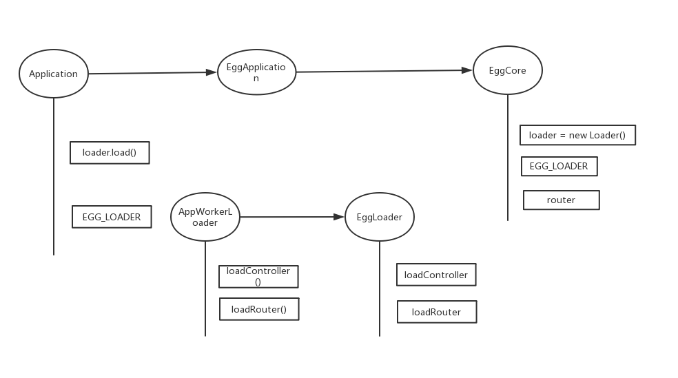
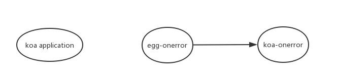

### 最简单版本的 controller, router
参考 `lib-router/simple.js`, 初始化 controller 只需要 new 一个实例，注册路由执行用户 router 中定义的方法即可。

```javascript
const PageController = require('../app/controller/page');
const routerRegister = require('../app/router');

class Application extends KoaApplication {
    constructor() {
        super();
        this.controller = {};
        this.controller.page = new PageController();
        this.router = new KoaRouter();
    }

    init() {
        routerRegister.call(this, this);
    }
}

let app = new Application();
app.init();
app.use(app.router.routes());

const server = require('http').createServer(app.callback());
server.listen(7001);
```

egg 就是把这个简单的过程丰富一下，写得合理一点，扩展性、容错性都好一点。同时也更复杂一点。

### controller, router 的处理
简单的关系图：



`Application extends EggApplication extends EggCore extends Koa`  

Application 在 `egg/lib/application`;

EggApplication 在 `egg/lib/egg`;

EggCore 在 `egg-core/lib/egg`;

#### Application
Application 定义了 EGG_LOADER 属性，指向 AppWorkerLoader，`AppWorkerLoader extends EggLoader`；

AppWorkerLoader 在 `egg/lib/loader/app_worker_loader`;

EggLoader 在 `egg-core/lib/loader/egg_loader`;

Application 调用 `loader.load` 方法，loader 是 EGG_LOADER 的实例，是在 EggCore 中实例化的，EggCore 也定义了 EGG_LOADER 属性，实际并没有用到。

load 方法在 AppWorkerLoader 中定义，执行 loadController, Router 方法，这两个方法在 EggLoader 定义。

### error
简单的关系图



koa application 通过 promise 的 catch 捕获到错误，promise 是 compose 生成的。

捕获错误后调用 ctx onerror 方法。此方法在 koa-onerror 中定义，通过 egg-onerror 引入，egg-onerror 在 app_worker_loader 中加载。

用了很多 config，方便用户自定义覆盖